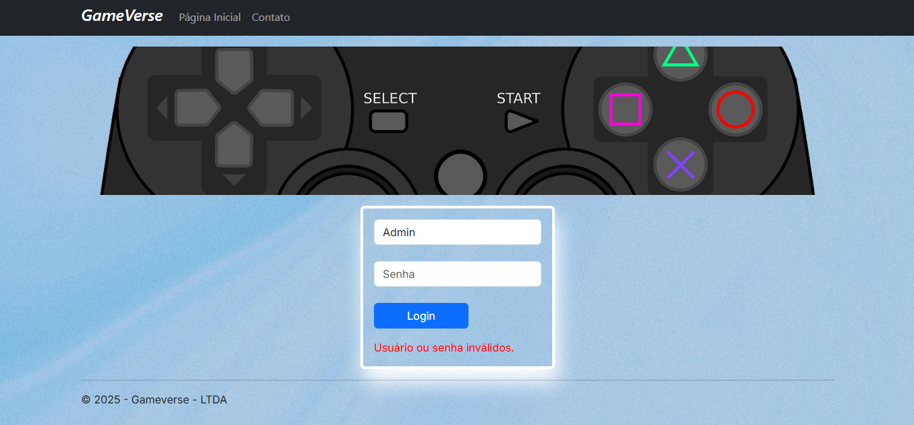
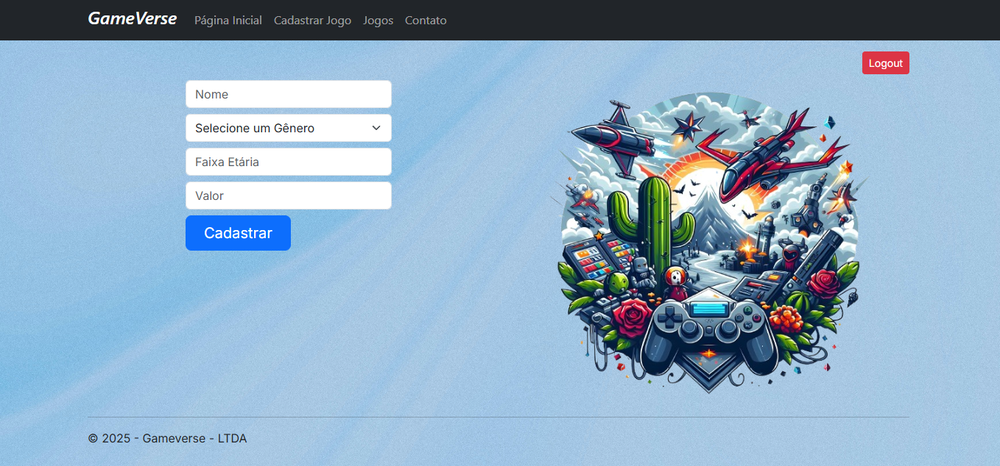
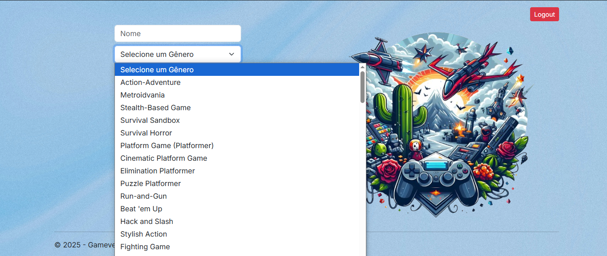
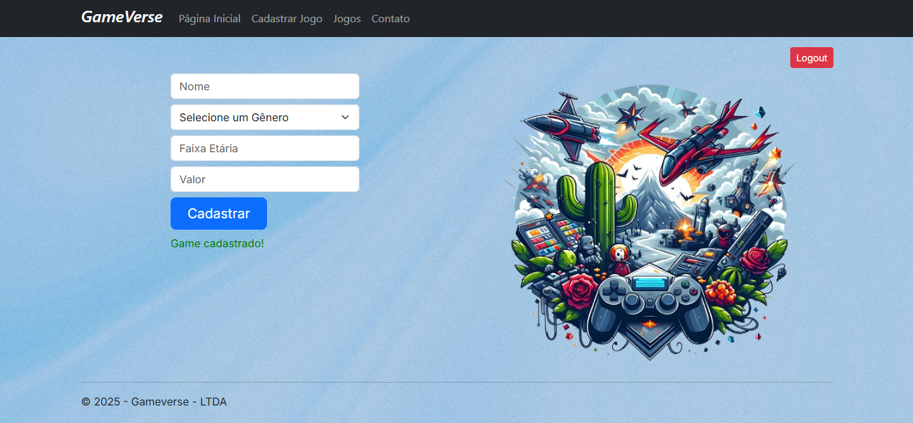
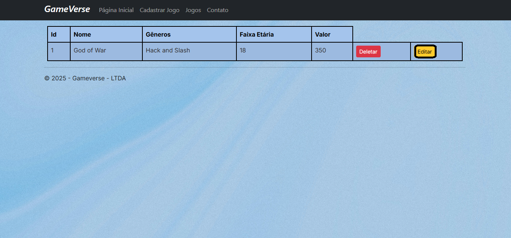
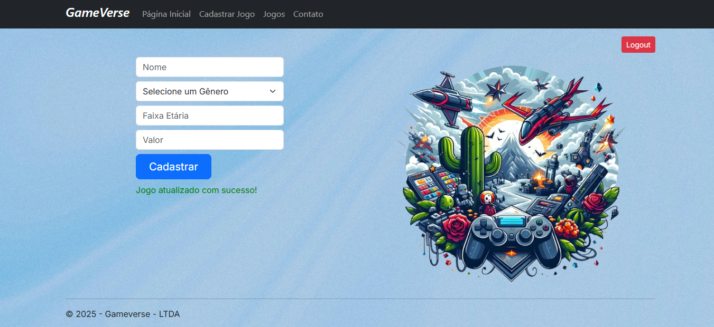
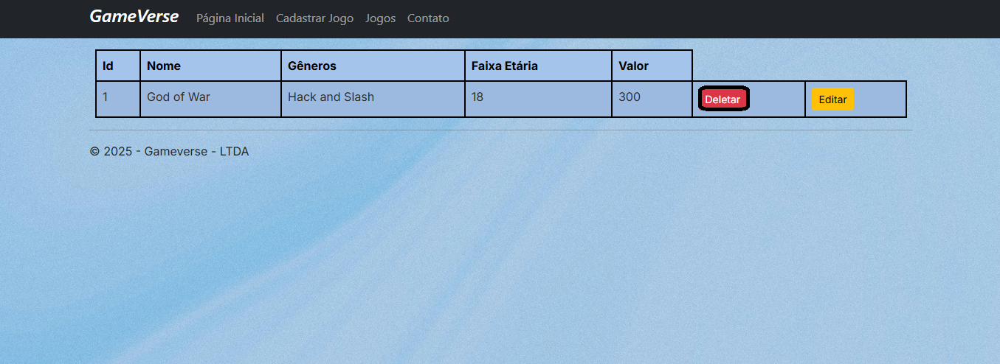
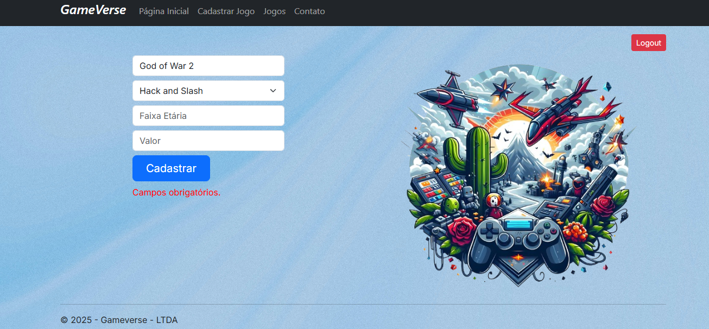
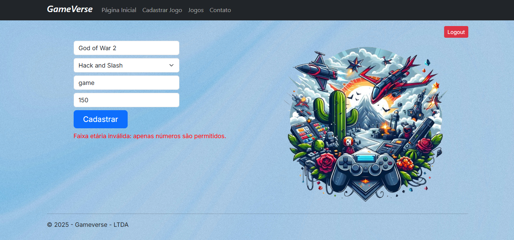

# 🚀 GameVerse: Meu Projeto Robusto de Gerenciamento CRUD e Busca de Jogos em **C#** com **ASP.NET Web Forms**

🎮 Estou **incrivelmente orgulhoso** de apresentar o **GameVerse**, um aplicativo web completo que desenvolvi para **revolucionar** a forma como interagimos com o universo dos videogames!  
Esta plataforma é uma **demonstração prática** das minhas habilidades em **programação C#** e **desenvolvimento web**, combinando uma **interface moderna** com funcionalidades **poderosas** e **eficientes**.

---

## ✨ O que o GameVerse faz?

O GameVerse oferece uma experiência **segmentada** e **otimizada**:

### 👥 Para o Usuário Final (Público)

- 🔍 **Exploração de Catálogo**: Permite a busca e visualização de uma vasta lista de jogos.  
- 🤖 **Busca Inteligente**: Autocomplete intuitivo enquanto o usuário digita, sugerindo títulos automaticamente. A busca é **robusta e flexível**, ignorando diferenças de maiúsculas/minúsculas.  
- 📄 **Conteúdo Detalhado e Contextual**: Informações ricas sobre cada jogo — jogabilidade, história, gênero, faixa etária e preço. Para alguns títulos, conteúdo **extraído de um JSON** é exibido de forma **visual** e **atraente**.  
- ❗ **Feedback Claro**: Caso um jogo não seja encontrado, uma mensagem informativa e **amigável** é exibida.  

---

### 🔐 Para o Administrador (Dashboard)

- 🛠️ **Painel de Controle Exclusivo**: Acesso protegido por **login**; apenas o administrador consegue gerenciar o conteúdo.  
- ✏️ **CRUD Completo**: Cadastrar, editar e excluir jogos de forma **intuitiva**.  
- ✅ **Validações Rigorosas**: Formulários com validação obrigatória, garantindo **dados precisos** e evitando inconsistências.  
- 🎯 **Confirmação de Ações**: Após o cadastro, uma mensagem de **sucesso** é exibida e o jogo já aparece na listagem geral.  

---

## 🛠️ Tecnologias Utilizadas

Este projeto foi construído com uma base **sólida e moderna**, focando em **desempenho** e **escalabilidade**:

- 💻 **Linguagem Principal**: C#  
- 🌐 **Framework Web**: ASP.NET Web Forms  
- ⚡ **Controles AJAX**: ASP.NET AJAX Control Toolkit para autocomplete e interações **sem recarregamento** da página.  
- 🎨 **Interface e Responsividade**: HTML, CSS e **Bootstrap** para um design **bonito**, **limpo** e **responsivo** (desktop, tablet e mobile).  
- 🗂️ **Manipulação de Dados**: Newtonsoft.Json para consumir e exibir informações de jogos a partir de **JSON**.  
- 🔗 **Consumo de API**: WebClient para integrar e popular o **dropdown de gêneros** com dados de uma API externa, **automatizando** o processo.  

---

## 🧩 Métodos e Arquitetura Chave

A robustez do **GameVerse** se dá através da aplicação de métodos e padrões **eficazes**:

- 🔒 **Controle de Acesso Administrativo**: Páginas sensíveis (ex.: `ControllerGame.aspx`) são **protegidas por sessão**. Se não estiver logado, o administrador é **redirecionado** automaticamente ao login.  
- 🧠 **Gerenciamento de Estado Inteligente**: Uso de **Session** para autenticação e **ViewState** para manter o estado das informações durante as edições, garantindo uma **experiência fluida**.  
- 🗃️ **Dados em Memória**: O **MemoryBank** simula o armazenamento e manipulação dos jogos, ideal para demonstrar as funcionalidades **CRUD**.  
- ⚙️ **Web Services (ASMX)**: Serviço assíncrono para o **autocomplete** da busca, proporcionando respostas **rápidas e eficientes**.  
- 🖼️ **Padrão Master Page**: Assegura **consistência visual** e **navegação uniforme** em todas as páginas.  
- 🛡️ **Validações Front-end e Back-end**: Garantem a **integridade dos dados**, verificando tipo e preenchimento dos campos antes do processamento.  

---

## 🚀 Conclusão

O **GameVerse** representa um projeto **completo**, que reúne **boas práticas** de desenvolvimento web e **programação orientada a objetos** com **C#** e **ASP.NET**.  
Estou muito feliz com o resultado e aberto a sugestões para evoluir ainda mais essa plataforma!  

---

## 🖼️ Galeria de Imagens

                  
